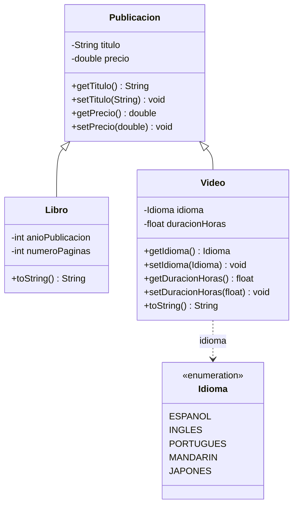

# Diagrama de clases — modelo con Libro y Video

Diagrama UML (Mermaid): jerarquía bajo `Publicacion`, enumeración `Idioma` para videos.

## Relaciones

- **Libro** y **Video** heredan de **Publicacion** (título y precio).
- **Video** usa **Idioma** (español, inglés, portugués, mandarín, japonés) y **duracionHoras** (`float`).
